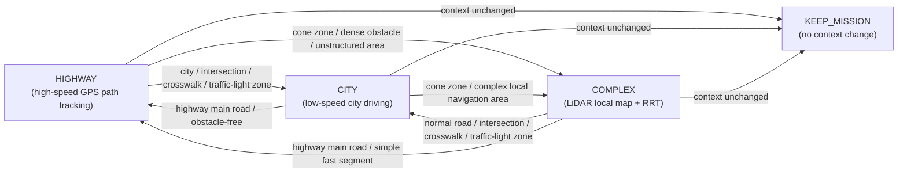
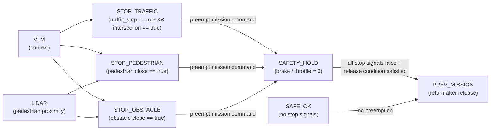

# GP_Decision
- gps 구동 명령어

```
ros2 launch ublox_gps ublox_f9p_launch.py
ros2 run fix2nmea fix2nmea
ros2 launch ntrip_client ntrip_client_launch.py
```

- f9p to utm_csv
```
python3 f9p_to_csv.py
ros2 launch gps_to_utm tf_gps_csv.launch.py
```

- 경로추종 chain
```
ros2 launch auto_drive bringup_single_f9p.launch.py \
  use_serial_bridge:=false \
  csv_file_path:=/home/yoo/GP_Decision/config/path_csv/rosbag2_2026_03_30.csv
```

- 토픽,TF 확인

ros2 topic echo /vehicle_heading_valid
ros2 topic echo /auto_steer_angle
ros2 topic echo /throttle_cmd
ros2 topic hz /roi_path
ros2 run tf2_ros tf2_echo csv vehicle_ref

이게 정상일 때 serial_bridge 붙이기
ros2 launch auto_drive bringup_single_f9p.launch.py \
  use_serial_bridge:=true \
  serial_port:=/dev/ttyACM0 \
  csv_file_path:= csv 경로


## 현재 구현 범위

- 구현 완료
  - single F9P 기반 Highway형 GPS path 추종 체인
  - 선점형 mission supervisor
    - mission layer: `/drive_context` 기반 `HIGHWAY/CITY/COMPLEX` 상태 관리
    - safety layer: `/manual_stop`, `/safety_stop`, `/traffic_stop && /intersection`, `/roi_warning`가 `throttle_cmd`를 선점
    - 상태 토픽: `/mission_state`, `/active_algorithm`, `/safety_status`, `/safety_active`
  - 현재 City/Complex는 전용 planner 대신 state 관리와 속도 정책까지 반영

- 확장 목표
  - City 전용 정지/재출발 판단 로직과 perception 연동 고도화
  - Complex에서 LiDAR cone map + RRT 기반 local waypoint 생성 및 추종 통합

- Complex RRT 1차 통합
  - `/csv_path`를 `vehicle_ref` 기준 전방 target으로 변환하여 `/complex/rrt_target` 발행
  - `/complex/cones` 또는 `/detected_objects` 기반 cone obstacle 생성
  - `/complex/rrt_target` + cone obstacle로 `/complex/local_path` 생성
  - `complex_pure_pursuit_node`가 `/complex/local_path`를 추종하여 `/complex/auto_steer_angle`, `/complex/throttle_from_planning` 발행
  - `command_mux_node`가 `/mission_state` 또는 `/drive_context`에 따라 Highway/Complex planning command를 선택하고 최종 `/auto_steer_angle`, `/throttle_from_planning` 발행
  - 최종 throttle은 기존 mission supervisor가 `/throttle_from_planning`을 받아 safety/mission policy를 적용한 뒤 `/throttle_cmd`로 발행

## Complex RRT 실행 흐름

기본 bringup은 기존과 동일하게 사용한다.

```bash
ros2 launch auto_drive bringup_single_f9p.launch.py csv_file_path:=/path/to/path.csv
```

Complex로 전환하려면 `/drive_context`에 complex 계열 문자열을 발행한다.

```bash
ros2 topic pub /drive_context std_msgs/msg/String "{data: complex}" --once
```

LiDAR perception은 다음 중 하나를 `vehicle_ref` 기준 또는 TF 변환 가능한 frame으로 발행해야 한다.

- `/complex/cones` (`geometry_msgs/PoseArray`): cone 중심점 목록
- `/detected_objects` (`visualization_msgs/MarkerArray`): `objects` marker와 `info` label marker를 매칭해 `Cone` 객체 중심점을 추출
  - object marker: `ns=objects`, `id=N`, `pose.position` = cone 중심좌표
  - label marker: `ns=info`, `id=10000+N`, `text` 첫 줄 = class label
  - 현재 매칭 규칙: `info.id - 10000 == objects.id`, label이 `cone_label_names`에 포함되면 cone obstacle로 사용

`/detected_objects` marker가 `frame_id=velodyne`으로 나오면 `vehicle_ref -> velodyne` TF가 필요하다. 기본 launch는 identity static TF를 발행한다. 실제 LiDAR 장착 위치가 `vehicle_ref`와 다르면 launch argument로 보정한다.

```bash
ros2 launch auto_drive bringup_single_f9p.launch.py \
  csv_file_path:=/path/to/path.csv \
  velodyne_x:=0.0 velodyne_y:=0.0 velodyne_z:=0.0 \
  velodyne_yaw:=0.0 velodyne_pitch:=0.0 velodyne_roll:=0.0
```

다른 LiDAR bringup이 이미 같은 TF를 발행하면 중복 TF를 피하기 위해 `publish_velodyne_tf:=false`로 실행한다. TF 확인은 다음 명령을 사용한다.

```bash
ros2 run tf2_ros tf2_echo vehicle_ref velodyne
```

주요 Complex 출력 토픽:

- `/complex/rrt_target`: GPS path 기반 RRT target
- `/complex/local_path`: RRT local path
- `/complex/rrt_status`: `missing_cones`, `direct_clear`, `reached_target`, `best_branch` 등 planner 상태
- `/planning_command_source`: 현재 최종 planning command source

# 시나리오 for Leader

- **Highway**
  - 장애물 없이 고속도로 본선을 일정 속도로 주행하는 시나리오를 가정. Leader는 GPS path를 따라 횡/종방향 제어 안정성에 집중하고, Follower는 Leader의 경로와 속도 변화를 안정적으로 추종하며 차량 간 간격이 과도하게 벌어지거나 좁혀지지 않는지 검증
  - GPS path, 횡/종방향 제어, leader-follower relative pose, V2V 또는 follower tracking 안정성 확인
    - Sensor Requirements: GPS/RTK, VLM context, leader-follower relative pose

- **City**
  - 도심 저속 주행 중 교차로와 횡단보도가 포함된 시나리오를 가정. Leader는 GPS path를 따라 차로를 유지하며 진행하다가, 횡단보도 앞 보행자 또는 교차로 신호에 따라 우선 정지하고 통과 가능해진 뒤 재출발한다. Follower는 Leader의 저속 주행, 정지, 재출발 흐름을 안정적으로 추종하며 차간거리와 경로 오차가 과도하게 커지지 않는지 검증
  - GPS path, traffic light/sign 또는 intersection context, pedestrian / vehicle detection & tracking, 횡단보도/정지선 인지, 정지 후 재출발 판단, leader-follower relative pose, follower tracking 안정성 확인
    - Sensor Requirements: GPS/RTK, 신호등/표지판/횡단보도/보행자 인지를 위한 전방 camera, 근거리 vehicle/pedestrian 확인을 위한 LiDAR, VLM context, leader-follower relative pose

- **Complex**
  - Leader는 GPS path를 rrt 타겟으로 사용해 콘 사이를 주행한다. GPS path는 전방 목표점을 만드는 용도이고 실제 주행에 사용되는 local 경로는 LiDAR로 생성한 cone 맵 위에서 RRT 브랜치를 고른 뒤 사용한다. **GPS가 장거리 목표를 주고, LiDAR을 이용하여 근거리 장애물/cone 맵을 만들어 local waypoint**를 생성하며, Follower는 Leader가 선택한 진행 흐름을 안정적으로 추종하는 것을 검증
  - LiDAR Cone Detection, cone map generation, GPS path 기반 장거리 target point 생성, local free-space / obstacle map, RRT 또는 local branch selection, local waypoint 생성 및 추종 제어, vehicle localization, leader-follower relative pose 또는 distance estimation, follower tracking 안정성 확인, VLM Complex transition
    - Sensor Requirements: GPS/RTK, cone 및 근거리 obstacle 인지를 위한 LiDAR, leader-follower relative pose

# Mission Supervisor 구상

- Mission supervisor는 **mission layer**와 **safety layer**를 분리한 **선점형 상태 기계(preemptive state machine) 노드**로 구성
- Mission layer는 README에서 정의한 **Highway / City / Complex** 3개 상태를 관리하며, **VLM의 context 정보**를 이용해 현재 주행 환경을 구분하고 상태를 전이
- 각 mission 상태에서는 서로 다른 주행 알고리즘 또는 파라미터를 적용
  - Highway: 상대적으로 고속의 GPS path 기반 주행
  - City: 저속 주행, 보행자/횡단보도/신호 대응 중심
  - Complex: LiDAR 기반 local map과 **RRT** 등을 사용하는 복잡 환경 주행
- Mission layer의 상태 전이는 아래와 같이 표현 가능



- Safety layer는 mission layer와 분리되어 동작하며, **항상 더 높은 우선순위**로 vehicle command를 선점
- 따라서 현재 mission이 Highway, City, Complex 중 무엇이든 관계없이, **VLM + LiDAR**를 통해 신호등, 보행자, 근접 장애물이 위험하다고 판단되면 **항상 정지 명령을 우선 적용**
- Safety layer의 선점 조건은 아래와 같이 표현 가능



- 정리하면, mission layer는 "어떤 주행 전략을 쓸지"를 결정하고, safety layer는 "지금 당장 멈춰야 하는지"를 최우선으로 판단하는 구조로 이해함
