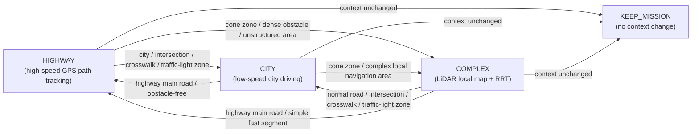
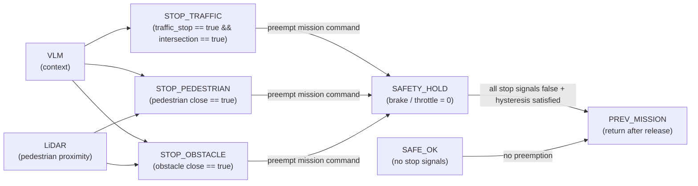

# midterm presentation overview

midterm presentation의 가이드라인은 아래 표와 같아.

|평가요소|세부 평가 항목|
|---|---|
|개발 진척도|기능별 구현 현황|
||WBS 및 간트차트|
|기술적 문제 해결 및 변경 사항|	설계 변경 근거|
||문제 해결 과정|
|단위 테스트 및 중간 검증	|모듈별 테스트 결과|
||정량 및 정성 평가|
|향후 일정 및 리스크 관리|	병목 구간 파악|
||대응 방안|


지금까지 나의 작업은 /Users/yoosm/FinalProject/GP_Decision 에 있어.

우선 현재까지 작업을 잘 이해하면 좋겠어.

표에서 모듈별 테스트 결과를 쓰는 부분이 있지? 그 파트에서 나의 모듈은 아래에 써줄 시나리오에 맞추어서 주행을 하는 것이야. (Decision 파트라고 생각하면 될 것 같아.)
Leader 위주로 이해하면 돼. 

시나리오를 잘 이해해줘.

## 시나리오 for Leader

- **Highway**
  - 장애물 없이 고속도로 본선을 일정 속도로 주행하는 시나리오를 가정. Leader는 GPS path를 따라 횡/종방향 제어 안정성에 집중하고, Follower는 Leader의 경로와 속도 변화를 안정적으로 추종하며 차량 간 간격이 과도하게 벌어지거나 좁혀지지 않는지 검증
  - GPS path, 횡/종방향 제어, leader-follower relative pose, V2V 또는 follower tracking 안정성 확인
    - Sensor Requirements: GPS/RTK, VLM context, leader-follower relative pose

- **City**
  - 도심 저속 주행 중 교차로와 횡단보도가 포함된 시나리오를 가정. Leader는 GPS path를 따라 차로를 유지하며 진행하다가, 횡단보도 앞 보행자 또는 교차로 신호에 따라 우선 정지하고 통과 가능해진 뒤 재출발한다. Follower는 Leader의 저속 주행, 정지, 재출발 흐름을 안정적으로 추종하며 차간거리와 경로 오차가 과도하게 커지지 않는지 검증
  - GPS path, traffic light/sign 또는 intersection context, pedestrian / vehicle detection & tracking, 횡단보도/정지선 인지, 정지 후 재출발 판단, leader-follower relative pose, follower tracking 안정성 확인
    - Sensor Requirements: GPS/RTK, 신호등/표지판/횡단보도/보행자 인지를 위한 전방 camera, 근거리 vehicle/pedestrian 확인을 위한 LiDAR, VLM context, leader-follower relative pose

- **Complex**
  - Leader는 GPS path를 rrt 타겟으로 사용해 콘 사이를 주행한다. GPS path는 전방 목표점을 만드는 용도이고 실제 주행에 사용되는 local 경로는 LiDAR로 생성한 cone 맵 위에서 RRT 브랜치를 고른 뒤 사용한다. **GPS가 장거리 목표를 주고, LiDAR을 이용하여 근거리 장애물/cone 맵을 만들어 local waypoint**를 생성하며, Follower는 Leader가 선택한 진행 흐름을 안정적으로 추종하는 것을 검증
  - LiDAR Cone Detection, cone map generation, GPS path 기반 장거리 target point 생성, local free-space / obstacle map, RRT 또는 local branch selection, local waypoint 생성 및 추종 제어, vehicle localization, leader-follower relative pose 또는 distance estimation, follower tracking 안정성 확인, VLM Complex transition
    - Sensor Requirements: GPS/RTK, cone 및 근거리 obstacle 인지를 위한 LiDAR, leader-follower relative pose

## Mission Supervisor 구상

- Mission supervisor는 **mission layer**와 **safety layer**를 분리한 **선점형 상태 기계(preemptive state machine) 노드**로 구성
- Mission layer는 README에서 정의한 **Highway / City / Complex** 3개 상태를 관리하며, **VLM의 context 정보**를 이용해 현재 주행 환경을 구분하고 상태를 전이
- 각 mission 상태에서는 서로 다른 주행 알고리즘 또는 파라미터를 적용
  - Highway: 상대적으로 고속의 GPS path 기반 주행
  - City: 저속 주행, 보행자/횡단보도/신호 대응 중심
  - Complex: LiDAR 기반 local map과 **RRT** 등을 사용하는 복잡 환경 주행
- Mission layer의 상태 전이는 아래와 같이 표현 가능



- Safety layer는 mission layer와 분리되어 동작하며, **항상 더 높은 우선순위**로 vehicle command를 선점
- 따라서 현재 mission이 Highway, City, Complex 중 무엇이든 관계없이, **VLM + LiDAR**를 통해 신호등, 보행자, 근접 장애물이 위험하다고 판단되면 **항상 정지 명령을 우선 적용**
- Safety layer의 선점 조건은 아래와 같이 표현 가능



---

## Perception 파트와의 연결성

- VLM에서 /drive_context(string type) 토픽으로 highway, city, complex를 넘겨주면 각 상황에 맞게 주행 전략을 다르게 가져가.

- VLM에서 신호등 정보를 토픽으로 넘겨주면 선점형 아키텍쳐에 맞추어 정지를 수행해야해. 

- 라이다에서 전방에 보행자가 감지되면 정지명령을 토픽(roi_warning)을 넘겨주어 정지 수행.(선점형)

- complex 상황에서의 주행은 /Users/yoosm/FinalProject/Mandol_all에서 사용한 gps, cone 기반 주행. rrt 알고리즘을 사용했음. 해당 부분도 너가 잘 확인해줘.

---

## 중간발표 슬라이드 구성안 (8장)

### 1장. 역할 정의와 발표 범위

- 슬라이드 제목
  - Leader Decision 파트 중간발표
- 핵심 메시지
  - 현재까지는 **Highway형 GPS path 추종**과 **선점형 mission supervisor** 구현을 완료했고, City/Complex는 확장 목표로 구분한다.
- 꼭 들어갈 내용
  - 담당 범위: Decision for Leader
  - 팀 내 파트별 역할 요약
    - Perception: `drive_context`, `traffic_stop`, `roi_warning` 등 상황 인지 토픽 제공
    - GPS/Localization: vehicle pose, heading, `csv -> vehicle_ref` TF 제공
    - Decision: mission state 관리, safety preemption, 최종 throttle arbitration
    - Control/Hardware: steering/throttle 명령 수신 및 차량 actuator 반영
  - 현재 작업 위치: `/Users/yoosm/FinalProject/GP_Decision`
  - 발표 범위: path 추종 체인, mission supervisor, 중간 검증, 향후 확장
  - 내 파트 입력/출력 정리
    - 입력: `/drive_context`, `/traffic_stop`, `/intersection`, `/roi_warning`, `/throttle_from_planning`
    - 출력: `/mission_state`, `/active_algorithm`, `/safety_status`, `/safety_active`, `/throttle_cmd`
- 시각 자료
  - 전체 시스템 블록도 1장
  - 팀 역할 요약 표 1개
- 발표 멘트 방향
  - "이번 중간발표에서는 현재 실제로 동작하는 Highway 주행 파이프라인과, 이를 안전하게 감싸는 선점형 supervisor 구현 결과를 중심으로 말씀드리겠습니다."
- 발표 대본 예시
  - "안녕하세요. 저는 Leader 차량의 Decision 파트를 담당하고 있습니다."
  - "전체 시스템 안에서 Perception은 상황 인지, GPS/Localization은 차량 위치와 자세 추정, Decision은 상황별 상태 관리와 안전 선점, Control은 실제 차량 제어를 담당합니다."
  - "이번 중간발표에서는 현재 실제로 구현이 완료된 기능과, 아직 확장 목표로 남아 있는 기능을 명확히 나누어 설명드리겠습니다."
  - "현재 완료된 범위는 Highway형 GPS path 추종과 선점형 mission supervisor이고, City와 Complex는 이 supervisor 위에 확장할 다음 단계로 두고 있습니다."
  - "즉 오늘 발표의 핵심은 현재 동작하는 주행 체인과, 이를 안전하게 관리하는 상태기계 구조입니다."

### 2장. 현재 시스템 아키텍처

- 슬라이드 제목
  - 전체 개요도와 현재 Leader 주행 아키텍처
- 핵심 메시지
  - 프로젝트 전체 개요 안에서 Decision 파트의 위치를 먼저 보여주고, 그 다음 내 파트 내부 아키텍처를 설명하는 흐름이 가장 이해하기 쉽다.
- 꼭 들어갈 내용
  - 전체 프로젝트 개요도
    - `Perception -> Decision -> Control -> Vehicle`
    - `GPS/Localization -> Decision` 보조 입력 연결
    - 여기서 `Decision` 박스를 강조해 내 파트 범위를 표시
  - 내 파트 상세 아키텍처
  - `single_f9p_heading.cpp`: heading 생성
  - `tf_gps_csv_single.cpp`: `csv -> vehicle_ref` TF 생성
  - `roi_path_node.py`: 전역 path 중 차량 전방 ROI 생성
  - `pure_pursuit_node.py`: 조향각, `throttle_from_planning` 생성
  - `mission_supervisor_node.py`: mission/safety arbitration 후 `throttle_cmd` 출력
- 시각 자료
  - 전체 시스템 개요도 1장
  - Leader 내부 노드 체인 다이어그램 1장
  - 주요 토픽 4~6개만 표시
- 발표 멘트 방향
  - "Leader는 전역 GPS 경로 전체를 그대로 따라가는 것이 아니라, 현재 위치 기준으로 잘라낸 ROI를 기반으로 pure pursuit 제어를 수행합니다."
- 발표 대본 예시
  - "먼저 프로젝트 전체 구조에서 제 파트가 어디에 위치하는지 보여드리겠습니다."
  - "Perception과 GPS/Localization이 Decision으로 입력을 주고, Decision은 최종적으로 Control로 넘길 명령을 정리하는 역할을 합니다."
  - "현재 Leader 주행 아키텍처는 GPS와 heading 정보를 바탕으로 차량 위치를 추정하고, 전역 경로 중 차량 앞부분만 ROI로 잘라서 제어에 사용하도록 구성했습니다."
  - "먼저 localization 단계에서 `csv` 프레임 기준 차량 위치와 자세를 만들고, 그 다음 ROI path를 생성합니다."
  - "pure pursuit 노드는 이 ROI path를 이용해 조향각과 planning throttle을 계산합니다."
  - "마지막으로 mission supervisor가 이 planning 명령을 그대로 통과시킬지, 아니면 safety 조건으로 선점할지를 결정합니다."

### 3장. 구현 완료 1 - Highway형 GPS Path 추종

- 슬라이드 제목
  - 구현 완료 1: Highway형 GPS path 추종
- 핵심 메시지
  - Highway 시나리오에서 Leader는 GPS path 기반 횡/종방향 제어를 안정적으로 수행하도록 구현되었다.
- 꼭 들어갈 내용
  - 현재까지 실제 구현 완료된 범위임을 명확히 표시
  - ROI 기반 경로 축소로 실시간 추종 안정화
  - Pure Pursuit 기반 조향 생성
  - 조향각 크기에 따라 속도를 줄이는 `throttle_from_planning` 생성
  - heading invalid, TF 없음, path 없음일 때 0 명령 처리
- 시각 자료
  - path 위 차량 위치와 ROI path 캡처
  - lookahead point 시각화 이미지
- 발표 멘트 방향
  - "현재 완료된 주행 기능은 Highway형 GPS path 추종이며, 실제 path tracking을 위한 핵심 제어 체인은 구축이 끝난 상태입니다."
- 발표 대본 예시
  - "먼저 구현 완료된 첫 번째 항목은 Highway형 GPS path 추종입니다."
  - "전역 경로 전체를 직접 사용하는 대신, 현재 차량 전방 구간만 ROI로 잘라서 제어에 사용하기 때문에 추종 안정성과 계산 효율을 동시에 확보했습니다."
  - "pure pursuit에서는 lookahead 기반으로 조향각을 만들고, 조향각이 커질수록 속도를 줄이는 방식으로 planning throttle을 생성합니다."
  - "또한 heading이 유효하지 않거나 TF 또는 path가 없는 경우에는 0 명령을 보내도록 해서 비정상 상황에 대한 안전장치도 넣었습니다."

### 4장. 구현 완료 2 - 선점형 Mission Supervisor

- 슬라이드 제목
  - 구현 완료 2: Preemptive Mission Supervisor
- 핵심 메시지
  - Mission layer와 Safety layer를 분리해, 상황별 상태 관리는 유지하면서도 정지 명령이 항상 우선되도록 설계했다.
- 꼭 들어갈 내용
  - mission state: `HIGHWAY`, `CITY`, `COMPLEX`
  - safety input: `/manual_stop`, `/safety_stop`, `/traffic_stop`, `/intersection`, `/roi_warning`
  - output: `/throttle_cmd`, `/mission_state`, `/active_algorithm`, `/safety_status`, `/safety_active`
  - traffic stop은 `traffic_stop && intersection`일 때만 유효
  - safety release에는 hysteresis 적용
  - 현재는 state 관리와 선점 로직까지 구현 완료, City/Complex 전용 planner는 아직 미연동
- 시각 자료
  - mission layer / safety layer 2단 구조도
  - `mission_state` 변화 GIF 또는 토픽 echo 캡처
- 발표 멘트 방향
  - "이번 중간발표 기준으로 mission supervisor는 구현 완료로 볼 수 있습니다. 다만 City/Complex의 전용 planner가 붙은 것은 아니고, 상태 관리와 선점 로직이 먼저 완성된 단계입니다."
- 발표 대본 예시
  - "두 번째 구현 완료 항목은 선점형 mission supervisor입니다."
  - "이 노드는 mission layer와 safety layer를 분리해서, 평상시에는 현재 주행 상황에 맞는 mission state를 유지하고, 위험 신호가 들어오면 어떤 mission 상태이든 바로 safety hold로 전환하도록 설계했습니다."
  - "현재 mission state는 Highway, City, Complex 세 가지로 관리하고 있고, `drive_context` 토픽을 통해 전환됩니다."
  - "안전과 관련해서는 manual stop, generic safety stop, traffic stop와 intersection 조합, 그리고 roi warning을 받아 최종 `throttle_cmd`를 선점합니다."
  - "따라서 이번 발표에서는 mission supervisor를 구현 완료로 제시하되, City와 Complex의 전용 planner 통합은 후속 확장 단계라고 구분해서 설명할 예정입니다."

#### Mission Supervisor GIF 재현용 ROS 2 명령 시퀀스

- 전제
  - Ubuntu + ROS 2 Humble 환경
  - `GP_Decision` workspace 빌드 완료
  - 아래 `<WS>`는 실제 workspace 경로로 변경
- 목적
  - `drive_context`를 수동으로 publish했을 때 `/mission_state`가 `HIGHWAY -> CITY -> COMPLEX -> HIGHWAY`로 바뀌는 모습을 녹화
  - safety preemption은 별도 토픽으로 추가 확인

**터미널 1: mission supervisor 실행**

```bash
source /opt/ros/humble/setup.bash
cd <WS>/GP_Decision
source install/setup.bash

ros2 run auto_drive mission_supervisor_node \
  --ros-args \
  --params-file /home/yoo/GP_Decision/src/leader/auto_drive/config/mission_supervisor.yaml \
  -p publish_rate_hz:=2.0 \
  -p command_timeout_sec:=5.0
```

**터미널 2: GIF에 찍을 상태 토픽 확인**

```bash
source /opt/ros/humble/setup.bash
cd <WS>/GP_Decision
source install/setup.bash

ros2 topic echo /mission_state
```

- 가능하면 tmux 또는 터미널 분할로 아래 토픽도 같이 띄우기

```bash
ros2 topic echo /safety_status
ros2 topic echo /throttle_cmd
```

- 참고
  - `mission_state`는 mission layer 변화만 보여줌
  - safety preemption 중에도 `mission_state`는 유지될 수 있으므로, safety 동작은 `/safety_status`, `/throttle_cmd`로 같이 보는 것이 좋음

**터미널 3: mission state 변화 재현**

```bash
source /opt/ros/humble/setup.bash
cd <WS>/GP_Decision
source install/setup.bash
```

```bash
ros2 topic pub --once /throttle_from_planning std_msgs/msg/Float32 "{data: 0.55}"
ros2 topic pub --once /drive_context std_msgs/msg/String "{data: 'highway'}"
sleep 2

ros2 topic pub --once /drive_context std_msgs/msg/String "{data: 'city intersection'}"
sleep 2

ros2 topic pub --once /drive_context std_msgs/msg/String "{data: 'complex cone zone'}"
sleep 2

ros2 topic pub --once /drive_context std_msgs/msg/String "{data: 'highway main road'}"
```

- 예상 관찰 결과
  - `/mission_state`: `HIGHWAY -> CITY -> COMPLEX -> HIGHWAY`

**추가 시퀀스: safety preemption 확인**

```bash
ros2 topic pub --once /throttle_from_planning std_msgs/msg/Float32 "{data: 0.55}"
sleep 1

ros2 topic pub --once /traffic_stop std_msgs/msg/Bool "{data: true}"
ros2 topic pub --once /intersection std_msgs/msg/Bool "{data: true}"
sleep 2

ros2 topic pub --once /traffic_stop std_msgs/msg/Bool "{data: false}"
ros2 topic pub --once /intersection std_msgs/msg/Bool "{data: false}"
sleep 2

ros2 topic pub --once /roi_warning std_msgs/msg/Bool "{data: true}"
sleep 2
ros2 topic pub --once /roi_warning std_msgs/msg/Bool "{data: false}"
```

- 예상 관찰 결과
  - `/mission_state`: 기존 상태 유지
  - `/safety_status`: `SAFE_OK -> STOP_TRAFFIC -> SAFE_OK -> STOP_ROI -> SAFE_OK`
  - `/throttle_cmd`: safety active 동안 `0.0`

**녹화 팁**

- GIF는 `mission_state`만 찍는 것보다 `/mission_state`, `/safety_status`, `/throttle_cmd` 3개를 세로 분할로 같이 찍는 편이 설명력이 높음
- `publish_rate_hz:=2.0`로 낮췄기 때문에 상태 반복 출력이 덜 심하고 GIF로 보기 쉬움
- 발표용으로는 8~12초 정도 길이로 잘라서 사용하면 충분함

### 5장. 중간 검증 및 테스트 결과

- 슬라이드 제목
  - 모듈별 테스트 및 중간 검증
- 핵심 메시지
  - 코드 레벨 회귀 테스트와 토픽 기반 시나리오 검증을 통해 supervisor 동작을 확인했다.
- 꼭 들어갈 내용
  - 현재 완료된 검증
  - 테스트 1: Highway 상태에서 planning throttle 정상 통과
  - 테스트 2: City context에서 더 보수적인 throttle policy 적용
  - 테스트 3: `traffic_stop && intersection` 입력 시 safety preemption
  - 테스트 4: generic `safety_stop` 입력 시 하위 호환 정지
  - 테스트 5: planning timeout 시 0 출력
  - 가능하면 추가 실험: 수동 토픽 publish 시 `mission_state` 변화 확인
  - 추가할 주행 검증 항목
    - Highway 주행 시 ROI path 생성 주기와 안정성 확인
    - heading valid 유지 여부 확인
    - `throttle_cmd`와 `auto_steer_angle` 동시 출력 확인
  - 앞으로의 테스트 계획
    - rosbag replay 기반 City context 전환 검증
    - `traffic_stop`, `roi_warning` 반복 입력 시 release hysteresis 검증
    - Complex 상태 진입/복귀와 local planner 연동 전후 비교 검증
- 시각 자료
  - 테스트 표
  - 터미널 캡처 또는 GIF
  - 가능하면 rosbag 기반 검증 계획 표 1개
- 발표 멘트 방향
  - "중간발표에서는 유닛테스트와 토픽 기반 검증을 함께 제시해서, 단순 설계가 아니라 실제 동작 논리가 검증되었음을 보여주는 것이 중요합니다."
- 발표 대본 예시
  - "중간 검증은 두 가지 층위로 진행했습니다."
  - "첫째는 코드 레벨 회귀 테스트로, Highway 상태의 throttle 통과, City 상태의 보수적 throttle policy, traffic stop 선점, generic safety stop 하위 호환, planning timeout 시 0 출력 등을 확인했습니다."
  - "둘째는 실제 토픽 기반 검증으로, `drive_context`를 수동 publish했을 때 `mission_state`가 기대한 순서로 변하는지 확인할 수 있도록 구성했습니다."
  - "즉 중간발표에서는 설계 아이디어 수준이 아니라, 현재 구현된 supervisor 논리가 재현 가능한 형태로 검증되었다는 점을 보여주고자 합니다."

### 6장. 설계 변경 근거와 현재 한계

- 슬라이드 제목
  - 설계 변경 근거 및 기술적 문제 해결
- 핵심 메시지
  - 기존 단순 throttle 차단 구조를 선점형 상태기계로 확장한 이유는, City/Complex 확장을 위해 mission과 safety를 분리해야 했기 때문이다.
- 꼭 들어갈 내용
  - 기존 구조: `/safety_stop`, `/manual_stop`만 반영하는 단순 throttle gating
  - 변경 구조: mission state 관리 + safety preemption + 상태 토픽 퍼블리시
  - 변경 이유
    - context 기반 확장성 확보
    - perception과의 인터페이스 명확화
    - 발표 및 디버깅을 위한 상태 가시성 확보
  - 현재 한계
    - 현재 완성된 주행 기능은 Highway형 path tracking 중심
    - City/Complex는 state와 속도 정책만 반영되어 있고, 전용 planner/perception 판단 로직은 아직 미완
- 시각 자료
  - before / after 구조 비교
  - 현재 구현 범위 vs 남은 구현 범위 비교 표
- 발표 멘트 방향
  - "이번 변경은 기능 추가보다 구조 개선의 의미가 큽니다. 이후 City/Complex를 붙이기 위한 상태기계 뼈대를 먼저 완성한 것입니다."
- 발표 대본 예시
  - "원래 구조는 planning throttle에 대해 단순히 stop 신호를 차단하는 형태였습니다."
  - "하지만 이 구조로는 Highway, City, Complex를 구분해서 관리하기 어렵고, perception 파트와의 인터페이스도 모호했습니다."
  - "그래서 이번에는 mission state 관리와 safety preemption을 분리한 상태기계 구조로 변경했습니다."
  - "다만 현재 시점에서 완전히 끝난 것은 아니고, 실제 주행 기능 기준으로는 Highway가 완료 범위이고 City와 Complex는 전용 알고리즘 통합이 남아 있습니다."
  - "이 변경의 목적은 지금 당장 기능을 많이 늘리는 것이 아니라, 이후 City와 Complex를 무리 없이 붙일 수 있는 확장 가능한 구조를 먼저 만드는 것이었습니다."

### 7장. 내 파트 간트차트 / WBS

- 슬라이드 제목
  - 내 파트 일정 계획과 진행 현황
- 핵심 메시지
  - 현재 완료 범위와 남은 작업을 시간축 위에 올려, 무엇이 끝났고 무엇이 후속인지 한눈에 보여준다.
- 꼭 들어갈 내용
  - 완료 구간
    - Highway형 GPS path 추종
    - 선점형 mission supervisor 뼈대
    - supervisor 중간 검증
  - 진행 예정 구간
    - City 정지/재출발 판단 로직
    - perception 토픽 연동 보완
    - Complex local planner 연동
    - 실차/rosbag 반복 검증
  - 가능하면 주차 단위 milestone 표시
- 시각 자료
  - 내 파트 간트차트 1장
  - WBS 요약 표 1개
- 발표 멘트 방향
  - "여기서는 현재 완료된 부분과 앞으로 남은 부분을 시간축 기준으로 구분해서 보여주는 것이 핵심입니다."
- 발표 대본 예시
  - "이 슬라이드는 제 파트의 간트차트입니다."
  - "앞부분에 있는 Highway path tracking과 mission supervisor 구현은 현재 완료된 범위이고, 이후에는 City와 Complex 확장을 순차적으로 진행할 계획입니다."
  - "특히 City는 perception 연동과 정지/재출발 판단, Complex는 local planner와 cone 기반 경로 생성을 중심으로 확장할 예정입니다."
  - "즉 현재 구조를 기반으로 기능을 순차적으로 올리는 계획이며, 구현 순서도 Highway에서 City, Complex 순으로 가져가겠습니다."

### 8장. 향후 일정과 리스크 관리

- 슬라이드 제목
  - 향후 확장 목표, 보완 계획, 리스크
- 핵심 메시지
  - Highway와 supervisor는 완료 범위로 제시하고, City/Complex는 perception 및 local planning 통합이 필요한 후속 단계로 명확히 분리한다.
- 꼭 들어갈 내용
  - 확장 목표 1: City
    - 신호/횡단보도/보행자 기반 정지 및 재출발 판단
    - perception 토픽 연동 고도화
  - 확장 목표 2: Complex
    - LiDAR cone map
    - GPS long-range target + local waypoint
    - RRT 또는 local branch selection 통합
  - 주요 리스크
    - perception 토픽 오검출/지연
    - mission context 오판단
    - Complex local planner 통합 난이도
  - 보완 계획
    - `drive_context` 오판단
      - 보완 방법: context hysteresis 또는 confirm 조건 추가
      - 완료 기준: 단발성 오입력에 state가 즉시 흔들리지 않음
    - `traffic_stop`, `roi_warning` 오검출
      - 보완 방법: debounce, minimum hold time, false release 조건 추가
      - 완료 기준: 토픽 노이즈 상황에서도 불필요한 stop/release 감소
    - City 미완 기능
      - 보완 방법: 정지선/신호/보행자 대응 로직 추가
      - 완료 기준: rosbag 기반 stop-go 시나리오 통과
    - Complex 미완 기능
      - 보완 방법: LiDAR cone map + local waypoint + RRT 통합
      - 완료 기준: complex context 진입 시 GPS global target과 local path가 함께 동작
  - 대응 방안
    - rosbag 기반 반복 검증
    - 시나리오별 토픽 인터페이스 고정
    - 단계별 통합: Highway -> City -> Complex
- 시각 자료
  - 보완 항목 표 1개
  - 리스크/대응 표 1개
- 발표 멘트 방향
  - "현재 완료 범위와 향후 목표를 명확히 분리해서, 중간발표에서는 구현 신뢰성과 다음 단계 계획을 동시에 보여주는 것이 중요합니다."
- 발표 대본 예시
  - "향후 일정은 현재 완료된 Highway와 supervisor를 기반으로 City와 Complex를 순차적으로 확장하는 방향으로 잡고 있습니다."
  - "City에서는 보행자, 신호등, 횡단보도에 대한 정지와 재출발 판단이 핵심이고, Complex에서는 LiDAR 기반 cone map과 local waypoint, 그리고 RRT 계열 branch selection 통합이 핵심입니다."
  - "주요 리스크는 perception 토픽의 오검출과 지연, context 오판단, 그리고 Complex local planner 통합 난이도입니다."
  - "이에 대해서는 rosbag 기반 반복 검증, 토픽 인터페이스 고정, 단계별 통합 순서로 대응할 계획입니다."
  - "특히 이번 발표에서는 리스크를 단순 나열하는 것이 아니라, 각 리스크에 대해 어떤 보완 방법을 적용하고 무엇을 완료 기준으로 볼지까지 같이 제시하려고 합니다."
