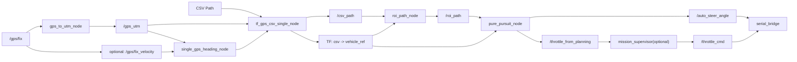

# GPS 1개 + GPS Path 기반 전진 경로 추종 방안

## 목적

이 문서는 현재 레포지토리의 구조를 기반으로, 다른 프로젝트에서 `GPS 1개`와 `미리 생성된 GPS path`만으로 차량이 경로를 추종하도록 만들기 위한 아키텍처를 정리한 문서다.

전제 조건은 아래와 같다.

- 주행은 `전진 위주`다.
- 전역 경로는 CSV 또는 유사한 방식으로 이미 존재한다.
- GPS는 1개만 사용한다.
- Pure Pursuit 기반 경로 추종을 유지하고 싶다.
- 현재 레포지토리의 `gps_to_utm -> tf/path -> ROI -> pure_pursuit` 구조를 최대한 재사용하고 싶다.

## 핵심 결론

GPS가 1개뿐이어도 경로 추종은 가능하다. 다만 현재 레포처럼 `두 GPS의 baseline`으로 heading을 만드는 방식은 사용할 수 없으므로, `heading 추정기`를 별도 구성해야 한다.

추천 구조는 다음과 같다.

- 위치: 단일 GPS를 UTM 또는 local metric 좌표로 변환
- 자세: GPS velocity 또는 연속 위치 차분으로 heading 추정
- 경로: 기존과 동일하게 전역 path와 ROI path를 사용
- 제어: Pure Pursuit 유지
- 안전 장치: 저속 또는 정지 상태에서 heading 불안정성을 처리하는 fallback 추가

즉, 이 구조의 성패는 `위치`보다 `heading 안정화`에 달려 있다.

## 현재 레포 기준으로 유지할 것과 바꿀 것

| 현재 레포 구성 | 1-GPS 프로젝트에서의 처리 | 메모 |
| --- | --- | --- |
| `f9p_to_utm` | 유지 | 단일 GPS를 metric 좌표로 변환 |
| `f9p_to_utm` | 제거 | 두 번째 GPS가 없으므로 불필요 |
| `azimuth_angle_calculator` | 제거 또는 대체 | 두 GPS로 heading 계산하던 부분을 1-GPS heading estimator로 교체 |
| `tf_gps_csv` | 단순화 후 유지 | `csv -> vehicle_ref` TF만 만들면 됨 |
| `f9r_roi_path` | 유지 가능 | 이름만 일반화하면 됨 |
| `pure_pursuit` | 유지 가능 | 입력 pose/heading만 바꾸면 됨 |
| `mission_supervisor` | 선택 유지 | 전진 위주라면 단순화 가능 |
| `serial_bridge` | 유지 가능 | `/auto_steer_angle`, `/throttle_cmd` 전달 |

## 왜 GPS 1개에서 어려운가

GPS 1개만으로도 현재 위치 `(x, y)`는 알 수 있다. 하지만 Pure Pursuit는 사실상 아래 3개가 필요하다.

- 현재 위치 `(x, y)`
- 현재 heading `psi`
- 전방 목표점 `(x_t, y_t)`

이 중 GPS 1개가 직접 주는 것은 위치다. heading은 직접 주지 않는다. 따라서 heading을 아래 방법 중 하나로 추정해야 한다.

1. GPS velocity 벡터 기반
2. 연속 위치 차분 기반
3. 경로 접선 기반 초기화 또는 저속 fallback
4. 가능하면 IMU 융합

이번 문서는 `GPS 1개만 사용`을 기준으로 하므로, 기본 설계는 `GPS velocity + 위치 차분 + path tangent fallback` 조합을 추천한다.

## 추천 아키텍처

## 추천 노드 구성

### 1. `gps_to_utm_node`

역할:

- 단일 GPS의 `NavSatFix`를 metric 좌표로 변환
- 출력 토픽 예시: `/gps_utm`

현재 레포의 [f9r_to_utm.cpp](/Users/yoosm/notimportant/Mandol_all/src/gps_to_utm/src/f9r_to_utm.cpp)를 거의 그대로 재사용하면 된다.

### 2. `single_gps_heading_node`

역할:

- 단일 GPS로부터 heading을 추정
- 출력 토픽 예시:
  - `/vehicle_heading_rad`
  - `/vehicle_heading_valid`
  - `/vehicle_ref_utm`

이 노드가 1-GPS 구조의 핵심이다.

#### 입력

- `/gps_utm`
- 가능하면 `/gps/fix_velocity` 또는 센서가 제공하는 velocity 토픽
- 선택적으로 `/csv_path`

#### 출력

- `heading` in radians
- heading validity flag
- 차량 제어 기준점의 위치

## heading 추정 방안

### 권장 1순위: GPS velocity 기반 heading

GPS 수신기가 속도 벡터 또는 ground course를 줄 수 있다면 이 방법이 가장 좋다.

예시:

- 속도 벡터가 `(v_x, v_y)`로 들어오면
- `psi = atan2(v_y, v_x)`

장점:

- 위치 미분보다 노이즈가 적다
- 고속 주행에서 안정적이다

주의:

- 속도가 매우 낮으면 heading이 흔들린다
- 정지 상태에서는 의미가 없다

따라서 아래처럼 속도 임계값을 둬야 한다.

- `speed > v_heading_enable`일 때만 velocity 기반 heading 갱신
- 그 외에는 마지막 유효 heading 유지

권장 초기값:

- `v_heading_enable = 1.0 m/s`
- `v_heading_disable = 0.5 m/s`

히스테리시스를 두면 속도 경계에서 깜빡이지 않는다.

### 권장 2순위: 연속 위치 차분 기반 heading

속도 벡터를 사용할 수 없으면 최근 두 개 이상의 위치로부터 진행 방향을 구한다.

예시:

- 이전 위치 `(x_prev, y_prev)`
- 현재 위치 `(x, y)`
- 이동 거리 `d = hypot(x - x_prev, y - y_prev)`
- `d > d_min`일 때
- `psi = atan2(y - y_prev, x - x_prev)`

장점:

- 추가 센서가 필요 없다

단점:

- GPS 노이즈가 크면 heading이 많이 흔들린다
- 저속에서 특히 취약하다

권장 초기값:

- `d_min = 0.3 ~ 0.5 m`

### 권장 3순위: path tangent 기반 초기화 / 저속 fallback

초기 출발 직전이나 저속 구간에서는 GPS heading이 불안정할 수 있다. 이때 경로의 접선 방향을 fallback으로 쓸 수 있다.

방법:

1. 현재 위치에서 path의 최근접점 `i`를 찾는다.
2. `path[i] -> path[i+k]` 방향으로 접선 각도를 계산한다.
3. heading이 아직 valid하지 않거나 속도가 매우 낮을 때만 임시로 사용한다.

예시:

- `psi_path = atan2(y[i+k] - y[i], x[i+k] - x[i])`

주의:

- 이 값을 항상 쓰면 차량의 실제 차체 방향과 경로 방향이 달라도 감지하지 못한다.
- 따라서 `always-on heading`이 아니라 `초기화 또는 fallback`으로만 쓰는 것이 좋다.

## 가장 추천하는 heading 융합 규칙

전진 위주 1-GPS 프로젝트라면 아래 규칙이 현실적이다.

1. 고속:
   `speed > 1.0 m/s`
   velocity 기반 heading 사용
2. 저속:
   `0.3 < speed <= 1.0 m/s`
   마지막 유효 heading 유지
3. 출발 직후:
   아직 유효 heading이 없으면 path tangent로 초기화
4. 정지:
   heading 갱신 금지, 마지막 값 유지

추가로 EMA 또는 1차 low-pass filter를 반드시 넣는 것이 좋다.

예시:

- `psi_filt = alpha * psi_new + (1 - alpha) * psi_prev`
- `alpha = 0.2 ~ 0.4`

단, 각도 필터는 wrap-around 문제가 있으므로 일반 실수처럼 바로 평균하지 말고 `sin`, `cos` 기반으로 처리하는 것이 안전하다.

## GPS 안테나 위치와 제어 기준점

1-GPS 구조에서는 GPS 안테나가 차량의 제어 기준점과 다를 가능성이 크다. 이 부분을 무시하면 Pure Pursuit 오차가 커질 수 있다.

권장 방식:

- Pure Pursuit 기준점은 `rear axle center` 또는 `vehicle_ref`
- GPS 안테나는 그 기준점에서 일정 오프셋을 가진 센서로 취급

예를 들어 GPS 안테나가 rear axle보다 차량 전방 `d_x`만큼 앞에 있다면:

- `x_ref = x_gps - d_x * cos(psi)`
- `y_ref = y_gps - d_x * sin(psi)`

더 일반적으로 안테나의 차량 좌표 오프셋이 `(d_x, d_y)`라면:

- `x_ref = x_gps - (d_x * cos(psi) - d_y * sin(psi))`
- `y_ref = y_gps - (d_x * sin(psi) + d_y * cos(psi))`

즉, GPS 위치를 그대로 제어점으로 쓰지 말고, 가능하면 `heading`을 이용해 제어 기준점으로 보정하는 것이 좋다.

## `tf_gps_csv_single_node` 설계

현재 레포의 [tf_gps_csv.cpp](/Users/yoosm/notimportant/Mandol_all/src/gps_to_utm/src/tf_gps_csv.cpp)는 두 GPS와 `/azimuth_angle`을 받아 `csv -> f9r`, `csv -> f9p`를 만든다.

1-GPS 버전에서는 아래처럼 단순화하면 된다.

### 역할

- CSV 파일을 읽어 `/csv_path`를 발행
- `/gps_utm` 또는 `/vehicle_ref_utm`를 CSV 원점 기준 좌표로 변환
- `heading`을 이용해 `csv -> vehicle_ref` TF를 발행

### 출력 프레임 예시

- parent: `csv`
- child: `vehicle_ref`

### 구현 포인트

- CSV 첫 점을 원점으로 두는 방식은 그대로 유지 가능
- 두 번째 GPS 관련 처리 제거
- heading 토픽을 `single_gps_heading_node`의 출력으로 변경

## ROI Path 노드

현재 레포의 [f9r_roi_path.cpp](/Users/yoosm/notimportant/Mandol_all/src/path_planning/src/f9r_roi_path.cpp)는 매우 잘 맞는 구조다.

1-GPS 프로젝트에서는 이름만 일반화하면 된다.

예시:

- `target_frame = vehicle_ref`
- `csv_frame = csv`
- 출력: `/roi_path`

이 노드의 장점은 아래와 같다.

- 전역 path에서 현재 위치 근처만 잘라줌
- 인덱스가 뒤로 가지 않도록 제한 가능
- path jump를 줄일 수 있음

전진 위주라면 이 구조를 거의 그대로 가져가는 것을 추천한다.

## Pure Pursuit 설계

Pure Pursuit는 유지 가능하다. 핵심은 입력 pose를 어떻게 주느냐만 바꾸면 된다.

### 입력

- 현재 차량 위치 `(x_ref, y_ref)`
- 현재 heading `psi`
- ROI path

### lookahead

현재 레포처럼 곡률 적응형 lookahead를 유지하는 것을 추천한다.

예시:

- `Ld = Ld_min + (Ld_max - Ld_min) * exp(-beta * kappa)`

전진 위주라면 후진용 `back_ld_` 같은 예외는 제거해도 된다.

### 목표점 선택

- 최근접점 탐색
- path를 따라 누적 거리 `Ld`가 되는 지점 보간

### 조향 계산

전형적인 Pure Pursuit 식을 그대로 사용하면 된다.

1. 목표점 방향각:
   `theta_t = atan2(y_t - y_ref, x_t - x_ref)`
2. heading 오차:
   `alpha = wrapToPi(theta_t - psi)`
3. 조향각:
   `delta = atan2(2 * L * sin(alpha), Ld)`

여기서:

- `L`: wheelbase
- `psi`: 차량 heading
- `Ld`: lookahead distance

이 방식이면 TF 회전에 의존하지 않고도 계산할 수 있다. 즉, 구현을 더 단순하게 하려면 `pure_pursuit.cpp`를 "TF 기반 벡터 회전" 대신 "직접 heading 사용" 구조로 바꾸는 것도 좋은 선택이다.

## 추천 토픽 구조

현재 레포 naming을 최대한 닮게 가면 아래처럼 설계할 수 있다.

- `/gps/fix`
- `/gps_utm`
- `/vehicle_heading_rad`
- `/vehicle_heading_valid`
- `/vehicle_ref_utm`
- `/csv_path`
- `/roi_path`
- `/auto_steer_angle`
- `/throttle_from_planning`
- `/throttle_cmd`

## 실제 ROS2 노드/토픽 설계안

이 섹션은 위 아키텍처를 실제 ROS2 프로젝트로 옮길 때 바로 구현할 수 있도록, 노드 이름, 메시지 타입, QoS, 파라미터, 주기까지 더 구체화한 설계안이다.

### 프레임 규칙

권장 프레임은 아래처럼 단순하게 가져가는 것이 좋다.

- `utm`: GPS가 변환된 절대 metric 좌표
- `csv`: 전역 경로의 로컬 map frame
- `vehicle_ref`: Pure Pursuit의 기준점

의미는 다음과 같다.

- `/gps_utm`는 `utm` 기준 절대 위치
- `/csv_path`는 `csv` 기준 경로
- TF는 `csv -> vehicle_ref`

즉, planner와 controller는 `csv` 프레임 안에서만 생각하고, GPS 절대 좌표는 초기에만 `csv` 기준으로 정렬하는 구조다.

### 패키지 구성 제안

현재 레포 스타일을 유지하면 아래처럼 나누는 것이 자연스럽다.

| 패키지 | 노드 | 역할 |
| --- | --- | --- |
| `gps_to_utm` | `single_gps_to_utm_node` | `NavSatFix -> PointStamped(UTM)` |
| `gps_to_utm` | `single_gps_heading_node` | 단일 GPS 기반 heading 추정 |
| `gps_to_utm` | `tf_gps_csv_single_node` | `/csv_path` 발행 + `csv -> vehicle_ref` TF 생성 |
| `path_planning` | `roi_path_node` | 전역 path에서 지역 ROI 추출 |
| `path_planning` | `pure_pursuit_node` | ROI path tracking으로 조향/추천 스로틀 계산 |
| `mission_supervisor` | `mission_supervisor_node` | 선택적 스로틀 중재 및 safety hold |
| `serial_bridge` | `serial_bridge` | 최종 steer/throttle를 MCU로 전달 |

## 노드별 상세 설계

### 1. `single_gps_to_utm_node`

역할:

- 단일 GPS fix를 UTM metric 좌표로 변환

권장 인터페이스:

| 종류 | 토픽 | 타입 | QoS |
| --- | --- | --- | --- |
| Sub | `/gps/fix` | `sensor_msgs/msg/NavSatFix` | `SensorDataQoS` |
| Pub | `/gps_utm` | `geometry_msgs/msg/PointStamped` | `10` |

권장 파라미터:

- `fix_topic: "/gps/fix"`
- `utm_topic: "/gps_utm"`
- `output_frame: "utm"`

구현 메모:

- 현재 레포의 [f9r_to_utm.cpp](/Users/yoosm/notimportant/Mandol_all/src/gps_to_utm/src/f9r_to_utm.cpp)를 거의 그대로 일반화하면 된다.
- altitude는 당장 path tracking에 꼭 필요하지 않지만 그대로 보존하는 것이 좋다.

### 2. `single_gps_heading_node`

역할:

- 단일 GPS에서 heading을 추정
- 필요하면 GPS 안테나 위치를 `vehicle_ref` 기준점으로 보정

권장 인터페이스:

| 종류 | 토픽 | 타입 | QoS |
| --- | --- | --- | --- |
| Sub | `/gps_utm` | `geometry_msgs/msg/PointStamped` | `10` |
| Sub | `/gps/fix_velocity` | `geometry_msgs/msg/TwistWithCovarianceStamped` | `SensorDataQoS` |
| Sub | `/csv_path` | `nav_msgs/msg/Path` | `reliable + transient_local` |
| Pub | `/vehicle_heading_rad` | `std_msgs/msg/Float64` | `10` |
| Pub | `/vehicle_heading_valid` | `std_msgs/msg/Bool` | `10` |
| Pub | `/vehicle_speed` | `std_msgs/msg/Float64` | `10` |
| Pub | `/vehicle_ref_utm` | `geometry_msgs/msg/PointStamped` | `10` |

권장 파라미터:

- `use_velocity_heading: true`
- `v_heading_enable: 1.0`
- `v_heading_disable: 0.5`
- `d_min_for_position_heading: 0.4`
- `heading_filter_alpha: 0.3`
- `antenna_offset_x: 0.0`
- `antenna_offset_y: 0.0`
- `use_path_tangent_fallback: true`
- `path_tangent_step: 5`

내부 상태:

- `last_valid_heading`
- `heading_valid`
- `last_position`
- `last_velocity_heading`
- `last_update_time`

권장 동작 순서:

1. velocity 토픽이 유효하고 속도 임계값 이상이면 velocity 기반 heading 계산
2. 아니면 위치 차분 기반 heading 계산 시도
3. 둘 다 불가능하면 마지막 valid heading 유지
4. valid heading이 아직 한 번도 없으면 path tangent로 초기화
5. heading이 있으면 GPS 안테나 위치를 `vehicle_ref` 위치로 보정
6. `/vehicle_heading_rad`, `/vehicle_heading_valid`, `/vehicle_ref_utm` 발행

권장 유효성 규칙:

- `speed > v_heading_enable`이면 heading update 허용
- `speed < v_heading_disable`이면 heading freeze
- 최근 heading 업데이트가 너무 오래 없으면 `heading_valid=false`

추가 추천:

- `diagnostic_msgs`를 쓰지 않더라도 최소한 로그 또는 debug 토픽으로 아래를 내보내는 것이 좋다.
  - `heading_source = velocity / delta_position / path_tangent / hold`
  - `speed`
  - `heading_age`

### 3. `tf_gps_csv_single_node`

역할:

- 전역 CSV path를 읽어 `/csv_path`로 발행
- `utm` 기준 차량 기준점을 `csv` 기준 위치로 바꿈
- `heading`을 써서 `csv -> vehicle_ref` TF를 발행

권장 인터페이스:

| 종류 | 토픽 | 타입 | QoS |
| --- | --- | --- | --- |
| Sub | `/vehicle_ref_utm` | `geometry_msgs/msg/PointStamped` | `10` |
| Sub | `/vehicle_heading_rad` | `std_msgs/msg/Float64` | `10` |
| Sub | `/vehicle_heading_valid` | `std_msgs/msg/Bool` | `10` |
| Pub | `/csv_path` | `nav_msgs/msg/Path` | `reliable + transient_local` |
| TF | `csv -> vehicle_ref` | `tf2` | TF 기본 |

권장 파라미터:

- `csv_file_path`
- `csv_frame_id: "csv"`
- `vehicle_frame_id: "vehicle_ref"`
- `path_publish_rate_hz: 10.0`
- `publish_tf_only_when_heading_valid: true`

권장 구현 규칙:

- CSV 첫 점을 원점으로 두는 방식은 현재 레포와 동일하게 유지
- heading이 invalid이면 TF 회전은 마지막 유효값 유지 또는 TF publish 정지
- path는 Transient Local로 발행해서 late joiner도 즉시 받을 수 있게 함

주의:

- `/vehicle_ref_utm`는 `utm` 기준이므로, CSV 첫 점의 절대 UTM을 origin으로 저장하고 `vehicle_ref_utm - csv_origin_utm`로 `csv` 상대좌표를 만들어야 한다.

### 4. `roi_path_node`

역할:

- `/csv_path` 전체 중에서 현재 차량 주변의 지역 경로만 추출

권장 인터페이스:

| 종류 | 토픽 | 타입 | QoS |
| --- | --- | --- | --- |
| Sub | `/csv_path` | `nav_msgs/msg/Path` | `reliable + transient_local` |
| TF input | `csv -> vehicle_ref` | `tf2` | TF 기본 |
| Pub | `/roi_path` | `visualization_msgs/msg/Marker` 또는 `nav_msgs/msg/Path` | `reliable + transient_local` |

권장 파라미터:

- `target_frame: "vehicle_ref"`
- `csv_frame: "csv"`
- `roi_length_m: 6.0`
- `timer_frequency: 20.0`
- `search_span_points: 2000`
- `hysteresis_k: 1`

권장 출력 타입:

- 디버깅과 RViz 시각화가 중요하면 `Marker`
- planner 재사용성과 범용성이 중요하면 `nav_msgs/Path`

개인적으로는 아래를 추천한다.

- 내부 계산용/표준용: `/roi_path` as `nav_msgs/Path`
- 시각화용: `/roi_path_marker` as `visualization_msgs/Marker`

지금 레포는 `Marker`를 쓰지만, 다른 프로젝트로 옮길 때는 `Path`가 더 일반적이다.

### 5. `pure_pursuit_node`

역할:

- ROI path를 따라 steering과 추천 throttle 계산

권장 인터페이스:

| 종류 | 토픽 | 타입 | QoS |
| --- | --- | --- | --- |
| Sub | `/roi_path` | `nav_msgs/msg/Path` 또는 `visualization_msgs/msg/Marker` | `10` |
| TF input | `csv -> vehicle_ref` | `tf2` | TF 기본 |
| Sub | `/vehicle_heading_valid` | `std_msgs/msg/Bool` | `10` |
| Pub | `/auto_steer_angle` | `std_msgs/msg/Float32` | `10` |
| Pub | `/throttle_from_planning` | `std_msgs/msg/Float32` | `10` |

권장 파라미터:

- `wheelbase`
- `min_lookahead`
- `max_lookahead`
- `beta`
- `curvature_window`
- `steer_limit_deg`
- `min_throttle`
- `max_throttle`
- `control_rate_hz`

추가 추천 파라미터:

- `steer_zero_when_heading_invalid: true`
- `throttle_zero_when_heading_invalid: true`
- `goal_reached_distance: 1.0`

권장 동작 규칙:

1. ROI path가 없으면 steer/throttle 0 또는 safe minimum
2. heading invalid이면 steer=0, throttle=0
3. 최근접점과 목표점 계산
4. curvature adaptive lookahead 적용
5. Pure Pursuit 식으로 steering 계산
6. steering 크기에 비례해 추천 throttle 감소

### 6. `mission_supervisor_node`

전진 위주 단일 GPS 프로젝트라면 이 노드는 단순화해서 써도 충분하다.

권장 인터페이스:

| 종류 | 토픽 | 타입 | QoS |
| --- | --- | --- | --- |
| Sub | `/throttle_from_planning` | `std_msgs/msg/Float32` | `10` |
| Sub | `/safety_stop` | `std_msgs/msg/Bool` | `10` |
| Sub | `/manual_stop` | `std_msgs/msg/Bool` | `10` |
| Pub | `/throttle_cmd` | `std_msgs/msg/Float32` | `10` |

권장 규칙:

- 정상 상태: `/throttle_cmd = /throttle_from_planning`
- safety stop: `/throttle_cmd = 0`
- manual stop: `/throttle_cmd = 0`

후진이 거의 없다면 현재 레포의 미션 상태머신을 그대로 가져가기보다, 이 정도로 단순화하는 편이 구현과 디버깅이 훨씬 쉽다.

### 7. `serial_bridge`

역할:

- `/auto_steer_angle`, `/throttle_cmd`를 MCU로 전달

권장 인터페이스:

| 종류 | 토픽 | 타입 |
| --- | --- | --- |
| Sub | `/auto_steer_angle` | `std_msgs/msg/Float32` |
| Sub | `/throttle_cmd` | `std_msgs/msg/Float32` |

현재 레포의 [serial_bridge.py](/Users/yoosm/notimportant/Mandol_all/src/serial_bridge/serial_bridge/serial_bridge.py)를 거의 그대로 재사용 가능하다.

## 권장 토픽 타입 최종안

실제로는 아래 세트로 가는 것을 추천한다.

| 토픽 | 타입 | 설명 |
| --- | --- | --- |
| `/gps/fix` | `sensor_msgs/msg/NavSatFix` | 원본 GPS |
| `/gps/fix_velocity` | `geometry_msgs/msg/TwistWithCovarianceStamped` | 선택적 속도 벡터 |
| `/gps_utm` | `geometry_msgs/msg/PointStamped` | GPS UTM |
| `/vehicle_heading_rad` | `std_msgs/msg/Float64` | 추정 heading |
| `/vehicle_heading_valid` | `std_msgs/msg/Bool` | heading 유효 여부 |
| `/vehicle_speed` | `std_msgs/msg/Float64` | 추정 속도 |
| `/vehicle_ref_utm` | `geometry_msgs/msg/PointStamped` | 제어 기준점 위치 |
| `/csv_path` | `nav_msgs/msg/Path` | 전역 경로 |
| `/roi_path` | `nav_msgs/msg/Path` | 지역 경로 |
| `/auto_steer_angle` | `std_msgs/msg/Float32` | 최종 조향 명령 |
| `/throttle_from_planning` | `std_msgs/msg/Float32` | planner 추천 스로틀 |
| `/throttle_cmd` | `std_msgs/msg/Float32` | 최종 스로틀 |

## launch 구성 제안

### `localization_single_gps.launch.py`

포함 노드:

- `single_gps_to_utm_node`
- `single_gps_heading_node`
- `tf_gps_csv_single_node`

목적:

- GPS 위치와 heading, TF, 전역 path까지 생성

### `planning_single_gps.launch.py`

포함 노드:

- `roi_path_node`
- `pure_pursuit_node`

목적:

- ROI 생성과 path tracking

### `control_single_gps.launch.py`

포함 노드:

- `mission_supervisor_node`
- `serial_bridge`

### `bringup_single_gps.launch.py`

포함:

- 위 3개 launch 전부 include

즉, 최종 bringup은 아래 흐름이면 된다.

1. localization
2. planning
3. control

## 초기 디버깅 순서

실제 구현에서 가장 중요한 것은 한 번에 다 붙이지 않는 것이다.

### 1단계: localization만 확인

확인 항목:

- `/gps_utm`가 정상인가
- `/vehicle_heading_rad`가 고속에서 안정적인가
- `/vehicle_ref_utm`가 안테나 보정 후 맞는가
- RViz에서 `csv -> vehicle_ref` TF가 path 위에 잘 올라가는가

### 2단계: planning만 확인

확인 항목:

- `/roi_path`가 현재 차량 앞쪽만 잘 자르는가
- start index가 뒤로 튀지 않는가
- lookahead point가 정상적인가
- 직선 path에서 steer가 작고 안정적인가

### 3단계: control 연결

확인 항목:

- heading invalid일 때 steer/throttle이 안전값으로 가는가
- 커브에서 throttle이 적절히 줄어드는가
- serial timeout 시 차량이 정지하는가

## 노드 간 의존성 규칙

실제로 구현할 때 아래 규칙을 두는 것이 좋다.

1. `pure_pursuit_node`는 `heading_valid=false`이면 조향을 만들지 않는다.
2. `roi_path_node`는 TF가 없으면 이전 경로를 유지하거나 publish를 멈춘다.
3. `tf_gps_csv_single_node`는 CSV가 안 읽히면 path를 publish하지 않는다.
4. `mission_supervisor_node`는 planner 스로틀이 안 들어오면 0을 출력한다.

이 규칙만 지켜도 bringup 초기에 시스템이 훨씬 안전해진다.

## 저속/정지 구간 처리 규칙

1-GPS 구조에서 가장 중요하다.

권장 규칙:

1. heading이 아직 valid하지 않으면 steering command를 0으로 유지
2. heading이 valid해질 때까지 throttle을 제한
3. 정지 또는 저속에서는 heading 갱신을 멈추고 마지막 유효값 유지
4. 필요하면 path tangent로만 초기화

이 규칙이 없으면 출발 직후 steering이 좌우로 흔들릴 가능성이 크다.

## 추천 throttle 전략

현재 레포의 철학을 그대로 가져가면 된다.

- 조향각이 작으면 throttle 증가
- 조향각이 크면 throttle 감소

예시:

- `throttle = max_throttle - norm(abs(delta)) * (max_throttle - min_throttle)`

전진 위주 프로젝트라면 `mission_supervisor`를 간소화해서 아래만 두어도 충분하다.

- normal driving
- obstacle/safety hold
- manual stop

## 추천 파라미터 초기값

아래 값은 시작점으로 쓰기 좋다.

### heading estimator

- `v_heading_enable = 1.0 m/s`
- `v_heading_disable = 0.5 m/s`
- `d_min_for_position_heading = 0.4 m`
- `heading_filter_alpha = 0.3`

### ROI

- `roi_length_m = 5.0 ~ 8.0`
- `timer_frequency = 15 ~ 20 Hz`
- `search_span_points = 충분히 크게`

### Pure Pursuit

- `wheelbase = 차량 실측값`
- `min_lookahead = 1.5 ~ 2.0 m`
- `max_lookahead = 3.0 ~ 5.0 m`
- `beta = 3.0 ~ 5.0`
- `steer_limit_deg = 차량 실한계에 맞춤`

## 구현 순서 추천

### 1단계

- `gps_to_utm_node`
- `tf_gps_csv_single_node`
- `/csv_path`
- RViz 상에서 GPS 위치와 path가 맞는지 확인

### 2단계

- `single_gps_heading_node`
- 고속에서 heading이 안정적으로 나오는지 확인
- 저속에서 last heading hold가 잘 되는지 확인

### 3단계

- `roi_path_node`
- `pure_pursuit_node`
- 저속 직선 path에서 steering이 안정적인지 확인

### 4단계

- 곡선 path에서 lookahead 튜닝
- throttle 연동
- safety hold 추가

## 현재 레포 기준으로 실제 변경 포인트

### 제거

- [f9p_to_utm.cpp](/Users/yoosm/notimportant/Mandol_all/src/gps_to_utm/src/f9p_to_utm.cpp)
- [azimuth_angle_calculator.cpp](/Users/yoosm/notimportant/Mandol_all/src/gps_to_utm/src/azimuth_angle_calculator.cpp)

### 유지 또는 재사용

- [f9r_to_utm.cpp](/Users/yoosm/notimportant/Mandol_all/src/gps_to_utm/src/f9r_to_utm.cpp)
- [tf_gps_csv.cpp](/Users/yoosm/notimportant/Mandol_all/src/gps_to_utm/src/tf_gps_csv.cpp) 구조
- [f9r_roi_path.cpp](/Users/yoosm/notimportant/Mandol_all/src/path_planning/src/f9r_roi_path.cpp)
- [pure_pursuit.cpp](/Users/yoosm/notimportant/Mandol_all/src/path_planning/src/pure_pursuit.cpp)
- [serial_bridge.py](/Users/yoosm/notimportant/Mandol_all/src/serial_bridge/serial_bridge/serial_bridge.py)

### 새로 추가 추천

- `single_gps_heading_node`
- `tf_gps_csv_single_node`

## 가장 현실적인 추천안

전진 위주이고 GPS 1개만 쓰는 프로젝트라면 아래 구성이 가장 현실적이다.

1. 단일 GPS를 UTM으로 변환한다.
2. GPS velocity가 있으면 그 벡터로 heading을 만든다.
3. 속도가 낮으면 마지막 유효 heading을 유지한다.
4. 출발 직후 heading이 없으면 path tangent로 초기화한다.
5. GPS 안테나 위치를 rear axle 기준점으로 보정한다.
6. 전역 path에서 ROI를 잘라낸다.
7. 곡률 적응형 Pure Pursuit로 조향각을 계산한다.
8. 조향각 기반 감속을 적용한다.

이 방식은 현재 레포의 철학을 유지하면서도 2-GPS 의존성만 제거하는 방향이라, 다른 프로젝트로 옮겨가기 가장 쉽다.

## 결론

GPS 1개와 GPS path만 있어도 전진 위주의 경로 추종은 충분히 가능하다. 다만 기존 듀얼 GPS 구조에서 빠지는 것은 `위치`가 아니라 `heading`이므로, 새로운 프로젝트의 핵심 노드는 `single_gps_heading_node`가 된다.

아키텍처를 한 문장으로 요약하면 아래와 같다.

`단일 GPS로 위치를 얻고, GPS velocity/위치 차분/path tangent로 heading을 안정화한 뒤, 기존 ROI + Pure Pursuit 구조에 넣어 경로를 추종한다.`
